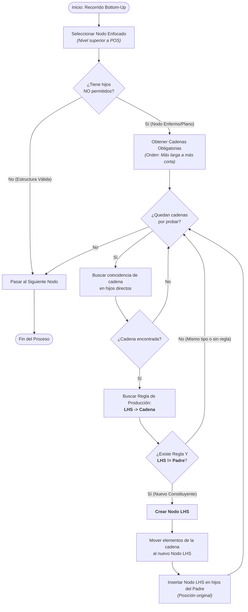

# DIAGRAMAS MERMAID

```mermaid
flowchart TD
    Start([Inicio: Recorrido Bottom-Up]) --> SelectNode["Seleccionar Nodo Enfocado<br/><i>(Nivel superior a POS)</i>"]
    
    SelectNode --> CheckChildren{"¿Tiene hijos<br/>NO permitidos?"}
    
    CheckChildren -- "No (Estructura Válida)" --> NextNode[Pasar al Siguiente Nodo]
    CheckChildren -- "Sí (Nodo Enfermo/Plano)" --> GetPatterns["Obtener Cadenas Obligatorias<br/><i>(Orden: Más larga a más corta)</i>"]
    
    GetPatterns --> IteratePatterns{"¿Quedan cadenas<br/>por probar?"}
    
    IteratePatterns -- No --> NextNode
    IteratePatterns -- Sí --> MatchPattern["Buscar coincidencia de cadena<br/>en hijos directos"]
    
    MatchPattern --> FoundMatch{"¿Cadena encontrada?"}
    
    FoundMatch -- No --> IteratePatterns
    FoundMatch -- Sí --> FindRule["Buscar Regla de Producción:<br/><b>LHS -> Cadena</b>"]
    
    FindRule --> CheckLHS{"¿Existe Regla Y<br/><b>LHS != Padre</b>?"}
    
    CheckLHS -- "No (Mismo tipo o sin regla)" --> IteratePatterns
    CheckLHS -- "Sí (Nuevo Constituyente)" --> CreateNode["<b>Crear Nodo LHS</b>"]
    
    CreateNode --> MoveChildren["Mover elementos de la cadena<br/>al nuevo Nodo LHS"]
    MoveChildren --> InsertNode["Insertar Nodo LHS en hijos del Padre<br/><i>(Posición original)</i>"]
    
    InsertNode --> IteratePatterns
    
    NextNode --> End([Fin del Proceso])
```
