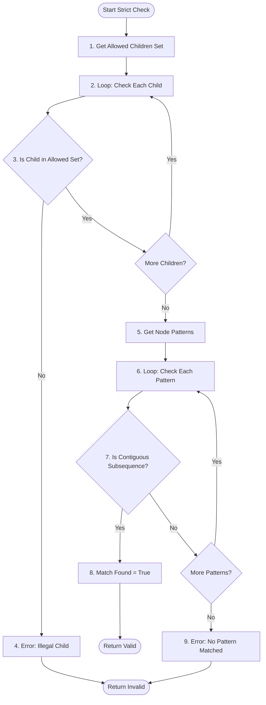
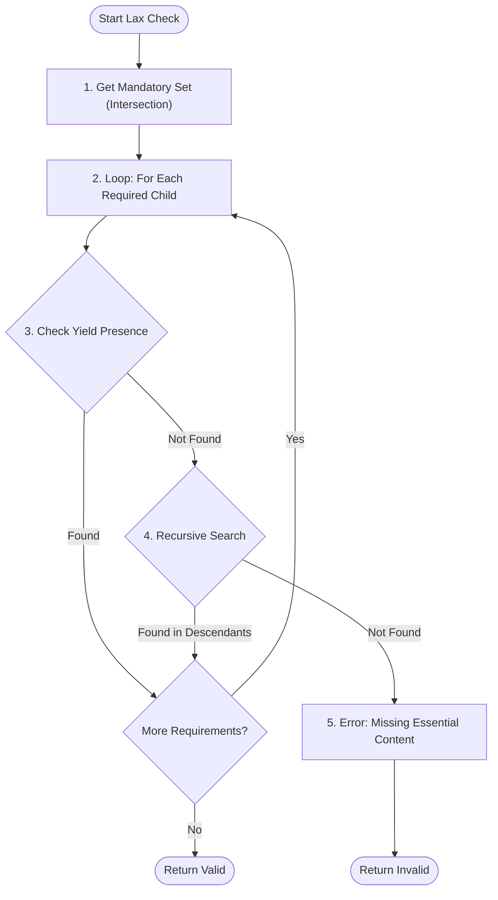
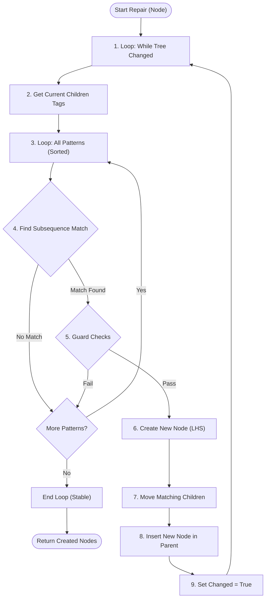

# Algorithm Deep Dive: Under the Hood

This document serves as a microscopic view of the Grammatomy engine. While the [Algorithm Overview](algorithm_overview.md) provides the "what" and "why", this document explains the "how".

We will dissect the three main algorithmic blocks—**Strict Validation**, **Lax Validation**, and **Reconstruction**—revealing the internal logic flow, decision trees, and data structures involved.

---

## 1. Strict Validation Logic (`_validate_strict`)

**Goal:** Determine if a node's immediate children perfectly match a canonical production rule.
**Context:** Used for final verification and rigorous testing.

### Flowchart

### Step-by-Step Logic

1. **Get Allowed Children Set**: The engine retrieves the `allowed_children` set for the node type (e.g., `sn`). This set is a fast filter derived from the union of all patterns plus any manually defined optional children.

2. **Loop: Check Each Child**: We iterate through the list of current children tags (e.g., `['spec', 'grup.nom']`).

3. **Is Child in Allowed Set?**:
   - **Check**: Is the current child tag present in the `allowed_children` set?
   - **Why**: This is a fast fail-safe. If a child isn't even allowed individually, the whole structure is invalid regardless of order.

4. **Error: Illegal Child**: If a child is forbidden, we immediately flag the node as invalid.
   - _Example_: A `VERB` inside a `sn` (Noun Phrase) would trigger this if not explicitly allowed.

5. **Get Node Patterns**: If all individual children are legal, we fetch the list of valid production `patterns` for this node type (e.g., `[[spec, grup.nom], [grup.nom]]`).

6. **Loop: Check Each Pattern**: We iterate through the available patterns to see if the current children configuration matches any of them.

7. **Is Contiguous Subsequence?**:
   - **The Core Check**: Does the list of children tags exactly equal the pattern list? Or, in a more complex scenario, does the pattern appear as a contiguous block within the children?
   - _Note_: In strict mode, we typically enforce an exact match for the whole sequence, but the engine supports subsequence checking for flexibility.
   - _Update_: The current implementation filters out punctuation tags (like `PUNCT`) from the children list before performing the pattern match, making the validation robust to commas and other separators.

8. **Match Found**: If a match is found, the node is structurally valid. We stop checking other patterns.

9. **Error: No Pattern Matched**: If we exhaust all patterns without a match, the structure is invalid (e.g., `[grup.nom, spec]` has the right components but in the wrong order).

10. **Error: No Pattern Matched**: If we exhaust all patterns without a match, the structure is invalid (e.g., `[grup.nom, spec]` has the right components but in the wrong order).

---

## 2. Lax Validation Logic (`_validate_lax`)

**Goal:** Verify if the node contains its essential semantic content (Yield), ignoring hierarchy flattening.
**Context:** Used for initial validation of raw parser output.

### Flowchart

### Step-by-Step Logic

1. **Get Mandatory Set**: The engine retrieves the `mandatory_children` set.
   - _Derivation_: This set is calculated at startup by intersecting all patterns.
   - _Example_: For `sp` (patterns: `[ADP, sn]`, `[ADP, S]`), the intersection is `{ADP}`.

2. **Loop: For Each Required Child**: We iterate through the mandatory types (e.g., just `ADP`).

3. **Check Yield Presence**:
   - **Direct Check**: Is `ADP` present in the immediate children?
   - If yes, this requirement is satisfied.

4. **Recursive Search**:
   - If not found directly, we search the **descendants** (grandchildren, great-grandchildren).
   - _Logic_: `_check_yield_presence` is called recursively.
   - _Example_: If `sn` requires `grup.nom`, and `grup.nom` requires `NOUN`, then an `sn` containing a `NOUN` (even without the intermediate `grup.nom` node) satisfies the requirement.

5. **Error: Missing Essential Content**: If a mandatory component is missing from the entire subtree, the node is invalid.
   - _Example_: An `sp` that contains only `sn` but no `ADP` (preposition) is invalid because it lacks the head that defines it as a prepositional phrase.

6. **Error: Missing Essential Content**: If a mandatory component is missing from the entire subtree, the node is invalid.
   - _Example_: An `sp` that contains only `sn` but no `ADP` (preposition) is invalid because it lacks the head that defines it as a prepositional phrase.

---

## 3. Reconstruction Logic (`_repair_node`)

**Goal:** Infer and insert missing intermediate nodes to restore canonical structure.
**Context:** The core "healing" process for flattened trees.

### Flowchart

### Step-by-Step Logic

1. **Loop: While Tree Changed**: The process is iterative. If we successfully create a new node (e.g., `grup.nom`), we must restart the scan because this new node might enable a higher-level pattern (e.g., `sn`) that wasn't visible before.

2. **Get Current Children Tags**: We read the list of children labels _fresh_ in every iteration (e.g., `['DET', 'NOUN', 'ADJ']`).

3. **Loop: All Patterns (Sorted)**: We iterate through the global list of patterns.
   - _Critical Detail_: The list is sorted by **Hierarchy Level** (inner first) and **Length** (longest first). This ensures we build `grup.nom` before `sn`.

4. **Find Subsequence Match**:
   - **Search**: Does the pattern (e.g., `[NOUN, ADJ]`) appear as a contiguous block in the children list?
   - _Example_: In `['DET', 'NOUN', 'ADJ']`, the pattern `[NOUN, ADJ]` matches at index 1.

5. **Guard Checks**: Before applying the change, we run safety checks:
   - **Recursion Guard**: Don't create an `sn` inside an `sn` if it results in a loop (X -> X).
   - **Topology Guard**: Don't create `ROOT` or `sentence` in invalid positions.
   - **Blacklist Guard**: The engine maintains a `RECONSTRUCTION_BLACKLIST` of `(parent, children)` patterns that are grammatically valid (and will pass validation) but are forbidden during reconstruction to prevent infinite loops (e.g., `S -> inc -> S`).

6. **Create New Node (LHS)**: We instantiate the new parent node defined by the pattern's Left-Hand Side (e.g., `grup.nom`).

7. **Move Matching Children**: The nodes identified in the match (`NOUN`, `ADJ`) are detached from their current parent and attached to the new `grup.nom`.

8. **Insert New Node in Parent**: The new `grup.nom` is inserted into the original children list at the position where the match started.
   - _Result_: `['DET', 'grup.nom']`.

9. **Set Changed = True**: We flag that a modification occurred, forcing the main loop (Step 1) to restart and scan the new structure.
