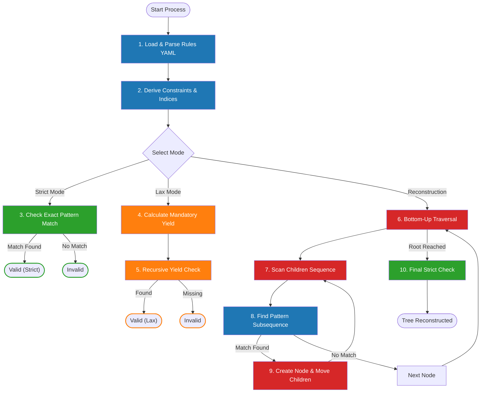

# Algorithm Overview: A Bird's-Eye View

This document provides a high-level visual guide to the three core algorithms of Grammatomy: **Strict Validation**, **Lax Validation**, and **Tree Reconstruction**.

Our goal is to make the internal logic transparent and accessible to both linguists and developers. We use a unified activity diagram to show how these processes interact and, crucially, how they reuse the same underlying logic blocks.

## The Unified Process Flow

The diagram below illustrates the lifecycle of a node or tree as it passes through our system.

- **Blue Blocks**: Shared Logic (Used by multiple algorithms).
- **Green Path**: Strict Validation (Rigorous check).
- **Orange Path**: Lax Validation (Permissive check).
- **Red Path**: Reconstruction (Repair process).

---

## Detailed Step-by-Step Description

### Phase 1: Initialization (Shared)

**1. Load & Parse Rules YAML**

- **What happens:** The system reads the `hybrid_rules.yaml` file. This file contains the "DNA" of our grammar: definitions for every valid node (like `sn`, `grup.verb`), their allowed children, and their production patterns.
- **Why it matters:** This is the single source of truth. If a rule isn't here, it doesn't exist for the engine.

**2. Derive Constraints & Indices**

- **What happens:** Before processing any text, the engine "compiles" the raw rules into optimized lookup tables.
  - It calculates the **Intersection of Patterns** to find out which children are absolutely mandatory (e.g., if `sp` always requires `ADP`, then `ADP` is mandatory).
  - It builds a **Reverse Index** to answer questions like "Who can be the parent of a `NOUN`?" instantly.
- **Why it matters:** This pre-calculation makes the validation extremely fast (O(1) complexity), allowing real-time feedback in the editor.

---

### Phase 2: Strict Validation (The "Purist" Check)

**3. Check Exact Pattern Match**

- **What happens:** The validator looks at a specific node (e.g., an `sn`) and its immediate list of children (e.g., `[spec, grup.nom]`). It compares this list against the `patterns` defined in the YAML.
- **The Rule:** The children must match a pattern **exactly** and **contiguously**. No extra nodes, no missing nodes, no wrong order.
- **Analogy:** Like a password check. If the password is "1234", entering "12345" or "124" fails.

---

### Phase 3: Lax Validation (The "Pragmatic" Check)

**4. Calculate Mandatory Yield**

- **What happens:** The engine asks: "What is the minimum content required for this node to exist?". It uses the intersection calculated in Step 2.
- **Example:** For a Prepositional Phrase (`sp`), the mandatory content is usually a preposition (`ADP`).

**5. Recursive Yield Check**

- **What happens:** The engine searches the **entire subtree** (descendants) of the node, not just immediate children. It looks for the mandatory content.
- **The Rule:** If the mandatory content exists _somewhere_ inside, the node is valid.
- **Why it matters:** This allows us to accept "flattened" trees from AI models (e.g., `sp -> ADP + NOUN`) where intermediate nodes (like `sn` or `grup.nom`) might be missing, but the core meaning is preserved.

---

### Phase 4: Reconstruction (The "Repair" Bot)

**6. Bottom-Up Traversal (Post-Order)**

- **What happens:** The reconstructor visits every node in the tree, starting from the deepest leaves and moving up to the root.
- **Why it matters:** We must repair the small parts (like `grup.nom`) before we can repair the big parts (like `sn`) that contain them.

**7. Scan Children Sequence**

- **What happens:** At each node, the algorithm looks at the current list of children (e.g., `[DET, NOUN, ADJ]`).

**8. Find Pattern Subsequence (Shared Logic)**

- **What happens:** It searches for any known pattern (from Step 1) hidden within the children list. It prioritizes:
  1. **Inner Constituents:** Tries to form `grup.nom` before `sn`.
  2. **Longest Match:** Tries to grab as many nodes as possible (Greedy).
- **Example:** In `[DET, NOUN, ADJ]`, it might find `NOUN + ADJ` matches the pattern for `grup.nom`.

**9. Create Node & Move Children**

- **What happens:** If a match is found (e.g., `NOUN + ADJ`), it creates a new node (e.g., `grup.nom`), detaches the matching children from their old parent, and attaches them to the new node. Then, it inserts the new node back into the sequence.
- **Loop:** The process repeats (Go to Step 7) until no more patterns can be formed in the current node.

**10. Final Strict Check**

- **What happens:** Once reconstruction is done, we run the **Strict Validation** (Step 3) on the result.
- **Why it matters:** This confirms that our repairs actually produced a valid, canonical tree.

---

## Key Takeaways for Contributors

1. **Reusability:** The `patterns` defined in YAML drive _everything_. Changing a rule in the YAML automatically updates the Strict Validator, the Lax Validator, and the Reconstructor.
2. **Hierarchy Matters:** The order in which we repair nodes (Bottom-Up) and the priority of patterns (Inner vs. Outer) is critical to avoiding infinite loops or incorrect groupings.
3. **Pragmatism:** Lax validation is our bridge between the messy reality of AI outputs and the strict theory of linguistics.
