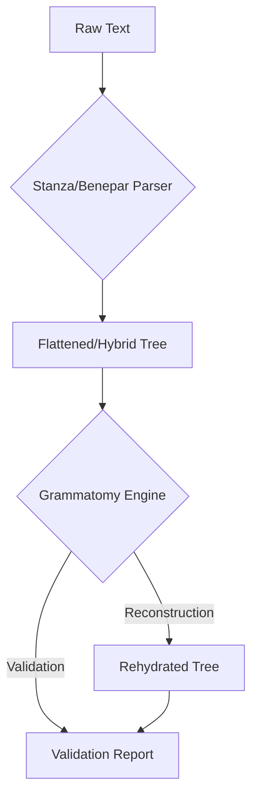
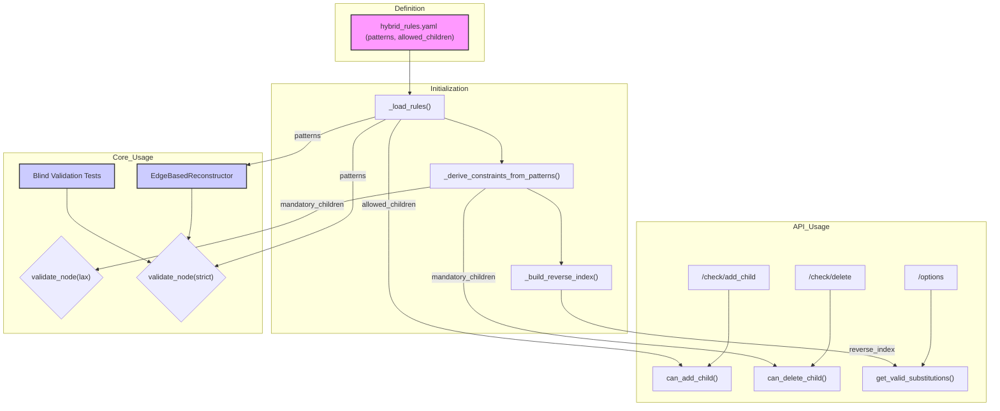

# Technical Deep Dive: Validation and Reconstruction Engine

## 1. The "Pragmatic Gap": Why This Engine Exists

Modern NLP models, particularly constituency parsers like **Stanza** and **Benepar**, are not designed to be linguistically pure. They are optimized for statistical accuracy and performance. As detailed in our internal audit ("_Auditoría Estructural Modelos Parsing Español.md_"), this leads to a "pragmatic gap" where the models' outputs, while correct from a software perspective, often deviate from formal grammatical theories (e.g., X-Bar Theory).

Key observed behaviors in SOTA models include:

1. **Hierarchy Flattening**: Intermediate phrasal nodes like `grup.nom` are often collapsed. A theoretically "correct" `(sn (spec (DET ...)) (grup.nom (NOUN ...)))` might be output as `(sn (DET ...) (NOUN ...))`.
2. **Tag Hybridization**: Pre-terminal nodes (POS tags) often use the **Universal Dependencies (UD)** tagset (e.g., `NOUN`, `VERB`), while phrasal nodes use a **Penn Treebank (PTB)**-style tagset (e.g., `NP`, `VP`) adapted from the **AnCora Corpus** (`sn`, `grup.verb`).
3. **Topological Quirks**: Punctuation may be attached directly to the `ROOT` node as a strategy to handle non-projectivity.

The Grammatomy Validation and Reconstruction Engine was designed not to rigidly reject these outputs, but to **understand and manage them**. Its philosophy is to **legalize the de-facto standard** of SOTA models, providing tools to validate their structural integrity and, when necessary, "rehydrate" flattened structures to a more canonical form.



---

## 2. The Hybrid Rule System: `hybrid_rules.yaml`

The entire system is governed by a single source of truth: `src/core/grammatomy/assets/rules/hybrid_rules.yaml`. This file codifies our hybrid grammar.

### 2.1. Production Rules (`patterns`)

The most critical section of a rule is the `patterns` list. These are **ordered production rules** that define the canonical structure of a constituent. The `hybrid_rules.yaml` file is no longer maintained manually. Instead, it is **auto-compiled** from a "pure" grammar definition located at `src/core/grammatomy/assets/rules/ancora_canonical.yaml`.

**Source**: The `ancora_canonical.yaml` file contains the "ground truth" grammar based on the official AnCora corpus guidelines, using its native POS tags (e.g., `n`, `v`, `s`). A compiler script, `tools/scripts/compile_rules.py`, then reads this canonical file, substitutes the native POS tags with their Universal Dependencies equivalents (e.g., `NOUN`, `VERB`, `ADP`), and generates the final `hybrid_rules.yaml` used by the engine. This two-step process allows for maintaining a pure, academic reference grammar while producing a pragmatic, model-compatible ruleset for production.

**Example (`sn`)**:

```yaml
nodes:
  - id: sn
    type: group
    patterns:
      - [grup.nom] # Minimal form: a nominal group
      - [spec, grup.nom] # Canonical form: specifier + nominal group
```

**Usage**:

1. **Reconstruction (`EdgeBasedReconstructor`)**: The reconstructor uses these patterns to find adjacent nodes that can be grouped into a new, higher-level constituent.
2. **Strict Validation (`ValidationEngine`)**: In `strict` mode, the validator checks if a node's children form a contiguous sequence that matches one of its defined `patterns`.

### 2.2. Permissive Containment (`allowed_children`)

This section defines which children are generally permitted within a parent, without enforcing strict order or contiguity. It's used for faster, more lenient checks.

**Source**: These are a superset derived from AnCora, UD, and empirical observation of parser outputs. They include both mandatory and optional children.

**Example (`grup.nom`)**:

```yaml
- id: grup.nom
  type: group
  allowed_children:
    mandatory: [NOUN]
    optional: [ADJ, sp, S] # Allows adjectives, PPs, or relative clauses
```

**Usage**:

- **Preventive Validation (API)**: Used by endpoints like `/check/add_child` to quickly determine if a drag-and-drop operation is legal.
- **Deletion Check (`can_delete_child`)**: The `mandatory` list is crucial for preventing the deletion of a node's essential components.

### 2.3. Deduced Rules & Heuristics

Some rules were not explicitly documented but were deduced to make the system work.

1. **Mandatory Children from Intersection**: The `ValidationEngine` programmatically deduces a core set of `mandatory_children` by finding the **intersection of all `patterns`** for a given node. For example, if `sp` has patterns `[ADP, sn]` and `[ADP, S]`, the engine deduces that `ADP` is mandatory. This is a powerful heuristic for lax validation.
2. **Reconstruction Hierarchy (`HIERARCHY_LEVELS`)**: In `EdgeBasedReconstructor`, we defined a numeric hierarchy. This was a critical deduction to solve the problem of greedy matching. It ensures the algorithm builds "inner" constituents (like `grup.nom`) before it attempts to build "outer" ones (`sn`), preventing incorrect groupings.

---

## 3. The Validation Engine (`ValidationEngine`)

This is the oracular core of the system, answering all questions about structural legality. It uses a **Multiton pattern**, ensuring only one instance exists per ruleset, which optimizes memory by not reloading the YAML file.

### 3.1. Post-Hoc Validation (`validate_node`)

This method is used to check a node's integrity after it has been created or modified. It has two main strategies:

- **`strategy="strict"`**:
  - **What it does**: Checks if the node's direct children form a sequence that exactly matches one of the `patterns` defined in the rules.
  - **What it does**: Checks if the node's direct children form a sequence that exactly matches one of the `patterns` defined in the rules. **Important**: The engine automatically filters out punctuation tags (`PUNCT`, `SYM`, etc.) from the children list before performing this check, making the validation robust to commas and other separators within a constituent.
  - **Use Case**: This is the final validation step. It's used by our test suites (`test_blind_validation.py`, `test_stress_refinement.py`) to confirm that the `EdgeBasedReconstructor` has produced a perfectly formed, canonical tree.

- **`strategy="lax"`**:
  - **What it does**: Checks for "yield presence." It doesn't care about the immediate children, only that the _essential content_ of a node is present somewhere among its descendants. The "essential content" is determined by the `mandatory_children` set (derived from pattern intersection).
  - **Example**: A `sn` in lax mode is valid if a `NOUN` (the essential content of `grup.nom`) exists somewhere within it, even if `grup.nom` itself is missing.
  - **Use Case**: Validating the raw, potentially flattened output from Stanza before reconstruction.

### 3.2. Preventive Validation (API)

These methods power the interactive editor, providing real-time feedback to the user.

| Method                      | API Endpoint       | Logic                                                                                                                 |
| :-------------------------- | :----------------- | :-------------------------------------------------------------------------------------------------------------------- |
| `can_add_child()`           | `/check/add_child` | Checks if a child tag is in the parent's `allowed_children` set.                                                      |
| `can_delete_child()`        | `/check/delete`    | Checks if deleting a child would violate the parent's `mandatory_children` list.                                      |
| `get_valid_substitutions()` | `/options`         | Returns a list of tags a node can be renamed to, by checking compatibility with its parent and its existing children. |
| `get_valid_parents()`       | (Internal)         | Uses a pre-computed `_reverse_index` for O(1) lookup of all possible parents for a given child tag. Powers dropdowns. |

---

## 4. The Reconstruction Engine (`EdgeBasedReconstructor`)

This algorithm's purpose is to "rehydrate" the flattened trees produced by SOTA parsers. It intelligently inserts the intermediate nodes that the parser omitted.

### 4.1. Core Algorithm: "Minimum Hydration"

The reconstructor operates on a simple but powerful principle:

1. **Traverse Bottom-Up**: It uses a `PostOrderIter` to visit child nodes before their parents. This ensures that the smallest, most internal constituents are built first.
2. **Find & Group**: At each node, it scans the list of its children, looking for an adjacent sequence that matches a `pattern` from the rulebook.
3. **Prioritize Matches**: To resolve ambiguity (e.g., `(NOUN, ADJ)` could be part of a `grup.nom` or something else), it uses a sorted list of all patterns in the grammar. The sorting is crucial:
    - **Primary Key: Hierarchy Level (Ascending)**. Our deduced `HIERARCHY_LEVELS` constant ensures `grup.nom` (level 1) is matched before `sn` (level 2).
    - **Secondary Key: Pattern Length (Descending)**. For patterns at the same level, it prefers the longest match (greedy matching).
4. **Create & Re-Parent**: When a match is found, it creates a new parent node (the pattern's "left-hand side"), moves the matched children under it, and inserts the new parent back into the original sequence.
5. **Blacklist Check**: Before applying a pattern, the reconstructor checks it against the `RECONSTRUCTION_BLACKLIST`. This list contains patterns (like `S -> inc`) that are valid if produced by the parser but are forbidden during reconstruction to prevent infinite loops.
6. **Loop Until Stable**: Because creating a new node (e.g., `sn`) might enable a new, higher-level match (`sp -> ADP, sn`), the process loops on each node until no more changes can be made.

### 4.2. Example Walkthrough

Consider a flattened tree from Stanza: `(S (DET El) (NOUN gato) (VERB come))`

1. **Node `S` is visited.** Its children are `[DET, NOUN, VERB]`.
2. The reconstructor scans for patterns. It finds a match for the pattern `(NOUN,) -> grup.nom`.
    - **Action**: Create a `grup.nom` node. Move the `NOUN` node under it.
    - **Tree becomes**: `(S (DET El) (grup.nom (NOUN gato)) (VERB come))`
3. **The loop on node `S` restarts** because a change was made. Children are now `[DET, grup.nom, VERB]`.
4. The reconstructor scans again. It finds a match for the pattern `(spec, grup.nom) -> sn`. (Note: `DET` is normalized to `spec`).
    - **Action**: Create an `sn` node. Move `DET` and `grup.nom` under it.
    - **Tree becomes**: `(S (sn (DET El) (grup.nom (NOUN gato))) (VERB come))`
5. **The loop on node `S` restarts.** Children are now `[sn, VERB]`.
6. The reconstructor finds a match for `(VERB,) -> grup.verb`.
    - **Action**: Create `grup.verb`. Move `VERB` under it.
    - **Tree becomes**: `(S (sn ...) (grup.verb (VERB come)))`
7. **The loop on node `S` restarts.** Children are now `[sn, grup.verb]`.
8. The reconstructor finds a match for `(sn, grup.verb) -> sentence`.
    - **Action**: Create `sentence`. Move `sn` and `grup.verb` under it.
    - **Tree becomes**: `(S (sentence (sn ...) (grup.verb ...)))`
9. **Loop restarts.** No more patterns match. The process for node `S` finishes.

The final, rehydrated tree is now structurally canonical and will pass `strict` validation.

---

## 5. Conclusion

The validation and reconstruction engine forms a symbiotic system.

- The **rules** provide a declarative, human-readable definition of a "correct" tree.
- The **reconstructor** uses these rules to algorithmically repair parser outputs.
- The **validator** uses the same rules to verify the reconstructor's work and to provide real-time guidance in the user interface.

This architecture allows Grammatomy to be both a powerful tool for analyzing the pragmatic output of modern NLP models and a rigorous environment for creating linguistically canonical syntactic trees.

---

## 6. Sources and Further Reading

The logic and heuristics described in this document are the result of extensive research into the practical behavior of SOTA models and the formal structure of linguistic corpora. For a deeper academic and technical dive, please consult the following internal reports located in the `references/` directory:

- **`Auditoría Estructural Modelos Parsing Español.md`**: A detailed audit on why SOTA models produce "flattened" or "hybrid" trees, justifying our "Pragmatic Gap" philosophy. It covers the technical reasons for tag collapse and non-canonical punctuation attachment.

- **`Análisis Constituyente Español SOTA.md`**: A state-of-the-art review of available parsing engines for Spanish (Stanza, Benepar, Seq2Seq models), detailing their architectures, performance metrics, and output formats.

- **`Especificación YAML de Árboles Sintácticos Híbridos.md`**: The original specification document that proposed the multi-language, hybrid-aware YAML rule system, comparing the structural philosophies of AnCora (ES), Penn Treebank (EN), VIT (IT), and CINTIL (PT).

- **`Banco de Pruebas Sintácticas Españolas.md`**: A comprehensive collection of "trap sentences" designed to stress-test parsers by exploiting known linguistic ambiguities in Spanish (e.g., attachment ambiguity, "se" constructions, gapping). This document is the source for our `test_stress_refinement.py` and `test_blind_validation.py` suites.

- **`Rigor_Linguistico.md` & `AnCora_Syntax_Analysis.md`**: Summaries of the formal grammatical rules from Penn Treebank and AnCora that form the basis of our "Strict Mode" validation.

## Appendix: Data Flow Diagram



This diagram illustrates how the rules defined in the YAML file feed different parts of the system.

1. **Definition**: Everything starts with the `hybrid_rules.yaml` file.
2. **Initialization**: When a `ValidationEngine` instance is created, the rules are loaded, processed, and used to derive optimized data structures like `mandatory_children` and the `_reverse_index`.
3. **API Usage**: The API endpoints use this pre-computed data to quickly respond to validation requests from the frontend.
4. **Core Usage**: The `EdgeBasedReconstructor` uses the `patterns` for its repair logic, and the validation tests use `validate_node` in `strict` mode to verify the final result. The `lax` mode can be used for a less rigorous initial validation.
