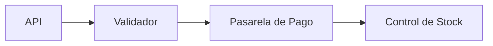

# Guía de Documentación

## 0. Acción previa

Antes de documentar conviene ordenar el contenido de cada módulo de una manera lógica, siguiendo las mejores prácticas y convenciones de estilo.

## 1. Estructura recomendada del archivo

El orden de arriba hacia abajo debería ser el siguiente:

1. **Shebang line:** Solo si el script se va a ejecutar directamente en Unix/Linux (`#!/usr/bin/env python3`).
2. **Docstring del módulo:** Un comentario multilínea `""" """` que explique qué hace el archivo.
3. **Imports:** Organizados en bloques (ver sección abajo).
4. **Metadatos a nivel de módulo:** Variables como `__author__` o `__version__`.
5. **Variables Globales / Constantes:** Definidas en `UPPER_CASE`.
6. **Excepciones personalizadas:** Clases que heredan de `Exception`.
7. **Clases:** Las piezas principales de lógica.
8. **Funciones:** Funciones auxiliares o independientes.
9. **Código ejecutable:** El bloque `if __name__ == "__main__":`.

---

## 2. El arte de los Imports

No los mezcles. El PEP 8 dicta que deben ir en tres bloques separados por una línea en blanco:

* **Bloque 1:** Librerías estándar de Python (ej. `os`, `sys`, `math`).
* **Bloque 2:** Librerías de terceros (ej. `requests`, `pandas`, `flask`).
* **Bloque 3:** Importaciones locales del propio proyecto.

> **Tip:** Dentro de cada bloque, ordénalos alfabéticamente. Hace que sea mucho más fácil detectar si algo ya está importado.

---

## 3. Dentro de las Clases

Para mantener la coherencia dentro de una clase, sigue este orden:

* **Atributos de clase** (variables compartidas).
* **Método `__init__**` (el constructor).
* **Métodos mágicos / especiales** (`__str__`, `__repr__`, `__call__`, etc.).
* **Propiedades** (`@property`, setters).
* **Métodos públicos** (la interfaz principal).
* **Métodos privados** (aquellos que empiezan con `_` y son de uso interno).

---

## 4. Convenciones de Estilo (Nomenclatura)

Para que tu código "hable" Python de forma nativa:

| Elemento | Convención | Ejemplo |
| --- | --- | --- |
| **Clases** | PascalCase | `UserProfileManager` |
| **Funciones / Métodos** | snake_case | `calculate_total()` |
| **Variables** | snake_case | `user_id` |
| **Constantes** | SCREAMING_SNAKE_CASE | `MAX_RETRY_ATTEMPTS` |
| **Privados** | `_` prefijo (un guion bajo) | `_internal_helper()` |

---

## 5. El toque final: `if __name__ == "__main__":`

Evita poner lógica suelta en el cuerpo del archivo. Si tu script hace algo, envuélvelo en una función llamada `main()` y llámala así:

```python
def main():
    # Tu lógica principal aquí
    print("¡Hola mundo!")

if __name__ == "__main__":
    main()

```

Esto permite que otros importen tus funciones o clases sin que el script se ejecute automáticamente.

---

## 1. Documentación de Paquetes (`__init__.py`)

Se centra en el "qué" y el "cómo" global.

```python
"""
Nombre del Paquete - Resumen breve en una línea.

Descripción extendida del paquete, explicando su propósito principal,
dependencias externas importantes y flujo de trabajo general.

Ejemplo:
    >>> import mi_paquete
    >>> mi_paquete.iniciar()

Attributes:
    CONSTANTE_GLOBAL (int): Descripción de una constante a nivel de paquete.
"""

```

---

## 2. Documentación de Módulos (`archivo.py`)

Similar al paquete, pero enfocado en el contenido del archivo específico.

```python
"""
Módulo de Procesamiento de Datos.

Este módulo contiene funciones para limpiar y transformar estructuras JSON
complejas en DataFrames de Pandas.
"""

```

---

## 3. Clases y Métodos

Es vital separar la documentación de la clase de la de su constructor `__init__` (aunque muchas herramientas las combinan).

```python
class Procesador:
    """
    Representa un motor de procesamiento de señales.

    La clase se encarga de gestionar el ciclo de vida de una señal analógica
    desde su captura hasta su digitalización.

    Attributes:
        id_motor (str): Identificador único del motor.
        estado (bool): Indica si el motor está encendido.
    """

    def __init__(self, id_motor: str):
        """
        Inicializa el procesador con un ID.

        Args:
            id_motor: El string que identifica al motor.
        """
        self.id_motor = id_motor
        self.estado = False

    def enviar_pulso(self, frecuencia: float, repetible: bool = False) -> int:
        """
        Envía un pulso de frecuencia específica.

        Args:
            frecuencia: Magnitud en Hz. Debe ser mayor a 0.
            repetible: Si el pulso debe reintentarse en caso de fallo.

        Returns:
            Código de estado (0 para éxito, 1 para error).

        Raises:
            ValueError: Si la frecuencia es negativa o cero.
        """
        pass

```

---

## 4. Funciones y Constantes

Para constantes simples, se usa el comentario `#:` si quieres que MkDocs lo extraiga.

```python
#: int: El límite máximo de reintentos para la conexión API.
MAX_RETRIES = 5

def calcular_impuesto(monto: float, tasa: float = 0.16) -> float:
    """
    Calcula el impuesto aplicado a un monto bruto.

    Args:
        monto: La cantidad base de dinero.
        tasa: El porcentaje de impuesto (ej. 0.16 para 16%).

    Returns:
        El monto total de impuestos calculados.
    """
    return monto * tasa

```

---

## Resumen de Mejores Prácticas (Pro-Tips)

1. **Tipado (Type Hinting):** No repitas el tipo de dato en el docstring si ya lo usas en el código (ej. `monto: float`). Deja que el docstring se encargue de la **explicación semántica**.
2. **Sección de `Raises`:** Es fundamental para que quien use tu código sepa qué errores debe capturar con un `try/except`.
3. **Sección de `Examples`:** Un pequeño bloque de código en el docstring vale más que mil palabras.

Sí, es totalmente posible, aunque el enfoque cambia. Mientras que para Python usamos **extracción automática** (mkdocstrings), para archivos de configuración como Dockerfiles, YAML o JSON, solemos usar **resaltado de sintaxis** y **anotaciones explicativas**.

Aquí tienes las mejores estrategias para documentar estos artefactos en MkDocs:

---

### 1. Documentación de Dockerfiles (Anotaciones)

El tema _Material for MkDocs_ tiene una funcionalidad llamada **Code Annotations**, que es perfecta para explicar qué hace cada línea de un Dockerfile sin llenar el archivo de comentarios feos.

**En tu archivo `.md`:**

````markdown
```dockerfile
FROM python:3.11-slim (1)
WORKDIR /app (2)
COPY . .
RUN pip install .
```

1. Usamos una imagen slim para reducir el tamaño y la superficie de ataque.
2. Definimos el directorio de trabajo donde vivirá el código.
````

---

### 2. Documentación de YAML (Esquemas y Tablas)

Para archivos YAML (como configuraciones de CI/CD o Kubernetes), lo más limpio es combinar un bloque de código con una **tabla de referencia**.

**Ejemplo de documentación de `config.yaml`:**

`````markdown
### Configuración del Sistema

````yaml
timeout: 30
debug: false

```markdown

| Parámetro | Tipo | Descripción | Por defecto |
| --- | --- | --- | --- |
| `timeout` | `int` | Tiempo máximo de espera en segundos. | `30` |
| `debug` | `bool` | Activa el registro detallado de errores. | `false` |
```
````
`````

---

### 3. Documentación de JSON (Esquemas Automáticos)

Si tu proyecto usa JSON para APIs o esquemas de datos, puedes usar el plugin **mkdocs-json-schema-plugin**. Este plugin toma un archivo de "JSON Schema" y genera una tabla visual y profesional automáticamente.

**Instalación:**

```bash
pip install mkdocs-json-schema-plugin

```

**En tu `.md`:**

```markdown
::: schema.json
```

---

### 4. Incluir archivos externos (Inclusión Dinámica)

A veces no quieres copiar y pegar el contenido del Dockerfile en el Markdown porque si el Dockerfile cambia, la documentación se desactualiza. Para eso usamos el plugin **mkdocs-include-markdown-plugin**.

**Configuración en `mkdocs.yml`:**

```yaml
plugins:
  - include-markdown
```

**Uso en el `.md`:**

```markdown
#### Nuestro Dockerfile actual


```

---

## 5. Visualización de Estructuras (Arbolado)

Para documentar la jerarquía de carpetas o archivos JSON complejos, el bloque de código `text` o `mermaid` ayuda a visualizar la estructura:

```text
📁 proyecto/
├── 📄 Dockerfile      # Imagen base y despliegue
├── 📄 settings.yaml   # Configuración de entorno
└── 📁 src/            # Código fuente

```

---

## 6. Resumen de herramientas por artefacto

| Artefacto       | Herramienta recomendada | Estilo de doc                                    |
| --------------- | ----------------------- | ------------------------------------------------ |
| **Dockerfile**  | Material Annotations    | Línea por línea con burbujas de texto.           |
| **YAML**        | Tables + Include Plugin | Tabla de parámetros y carga directa del archivo. |
| **JSON**        | JSON Schema Plugin      | Generación de tablas desde el esquema.           |
| **Estructuras** | Mermaid o Bloques Text  | Diagramas de flujo o árboles de directorios.     |

¿Te gustaría que te ayude a crear un **JSON Schema** para tus archivos de configuración, de modo que MkDocs pueda generar las tablas de parámetros automáticamente?

---

## MKDOCKS

### 1. Instalación de Dependencias

Primero, asegúrate de tener las herramientas necesarias. El plugin `python` es el que hace la magia de leer tus archivos `.py`.

```bash
pip install mkdocs mkdocs-material mkdocstrings[python]

```

---

### 2. Configuración de `mkdocs.yml`

Este archivo vive en la raíz de tu proyecto. Aquí le decimos a MkDocs que use el estilo de **Google** que vimos antes y dónde buscar tu código.

```yaml
site_name: Mi Proyecto Pro
theme:
  name: material # El tema más popular y profesional

plugins:
  - search
  - mkdocstrings:
      handlers:
        python:
          paths: [src] # Indica dónde está tu código fuente
          options:
            docstring_style: google # Cambia a numpy si prefieres ese
            show_root_heading: true
            show_source: true # Permite ver el código fuente desde la web

nav:
  - Inicio: index.md
  - Referencia API: api.md
```

---

### 3. Estructura de Archivos Sugerida

Para que Python y MkDocs se lleven bien, lo ideal es una estructura tipo `src`:

```text
mi_proyecto/
├── mkdocs.yml
├── docs/
│   ├── index.md
│   └── api.md        # Aquí invocaremos tu código
├── src/
│   └── mi_paquete/
│       ├── __init__.py
│       └── procesador.py
└── setup.py (o pyproject.toml)

```

---

### 4. Cómo invocar la documentación en tus `.md`

En tu archivo `docs/api.md`, solo tienes que usar el identificador de objeto. El plugin se encargará de buscar el `__init__.py` y los módulos.

#### Para documentar el paquete completo

```markdown
# Referencia Completa

::: mi_paquete
```

#### Para documentar una clase específica

Si solo quieres mostrar una parte:

```markdown
# El Procesador Central

::: mi_paquete.procesador.Procesador
```

---

### 5. El flujo de trabajo Master

Una vez configurado, el proceso es:

1. **Escribes código** y su docstring (siguiendo la plantilla de Google).
2. **Ejecutas** `mkdocs serve` en tu terminal.
3. **Previsualizas** en `http://127.0.0.1:8000`. Cualquier cambio en el código se reflejará instantáneamente en la web.

#### Un pequeño "Tip" de experto

Si notas que MkDocs no encuentra tus módulos, es porque el directorio `src` no está en el `PYTHONPATH`. Al usar la opción `paths: [src]` en el `mkdocs.yml` (como puse arriba), el plugin lo soluciona por ti sin que tengas que tocar variables de entorno.

## Integrando diagramas Mermaid y PlantUML en Docstrings de Python

Incluir diagramas **Mermaid** y **PlantUML** dentro de los **docstrings** de Python es una de las técnicas más avanzadas y útiles para documentar lógica compleja.

Cuando usas **MkDocs** con **mkdocstrings**, el flujo es el siguiente: el plugin extrae el docstring, lo convierte en Markdown y, si tienes activada la extensión de Mermaid o PlantUML, lo renderiza como un gráfico interactivo en la web.

Aquí tienes cómo aplicarlo en diferentes niveles:

---

### 1. En un Paquete (`__init__.py`)

Ideal para explicar la arquitectura general o el flujo de datos entre submódulos.

````python

"""
Paquete de Procesamiento de Pedidos.

Este paquete coordina la validación, el cobro y el envío.



"""

````

---

### 2. En una Clase o Método (Algoritmo complejo)

Si un método tiene una lógica de decisión ramificada, un diagrama de flujo (`flowchart`) es mucho más claro que 10 párrafos de texto.

````python
def procesar_transaccion(self, datos: dict):
    """
    Ejecuta el flujo de validación de seguridad.

    Args:
        datos: Diccionario con la info del pago.

    ```mermaid
    stateDiagram-v2
        [*] --> Verificando
        Verificando --> Denegado: Fraude detectado
        Verificando --> Aprobado: Scoring OK
        Aprobado --> Ejecutando
        Ejecutando --> [*]
    ```
    """
    pass

````

---

### 3. En una API REST (Casos de Uso)

Si estás documentando un controlador o una interfaz de API, puedes usar un diagrama de secuencia para mostrar la interacción entre el cliente, la API y la base de datos.

````python
class UsuarioController:
    """
    Controlador para la gestión de perfiles.

    ```mermaid
    sequenceDiagram
        Cliente->>API: POST /login
        API->>DB: Consultar usuario
        DB-->>API: Usuario encontrado
        API-->>Cliente: 200 OK + JWT
    ```
    """

````

---

### Consejos de Oro para que funcione

Para que MkDocs renderice esto correctamente desde tus docstrings, asegúrate de:

1. **Triple tilde:** Envuelve el código Mermaid en bloques ````mermaid`.
2. **Sangría correcta:** El bloque de Mermaid debe estar alineado con el texto del docstring. Si el docstring tiene una sangría de 4 espacios, el bloque Mermaid también.
3. **Configuración de `mkdocs.yml`:** Debes tener configurado `pymdownx.superfences` como te mostré antes, de lo contrario, verás el código plano en lugar del gráfico.

---

### Limitación a tener en cuenta

La única "pega" es que **IDE como PyCharm o VS Code** podrían no renderizar el gráfico Mermaid directamente en la ventana flotante de ayuda (pop-up), ya que suelen soportar Markdown básico. Sin embargo, en tu sitio web generado por **MkDocs**, se verá espectacular.
